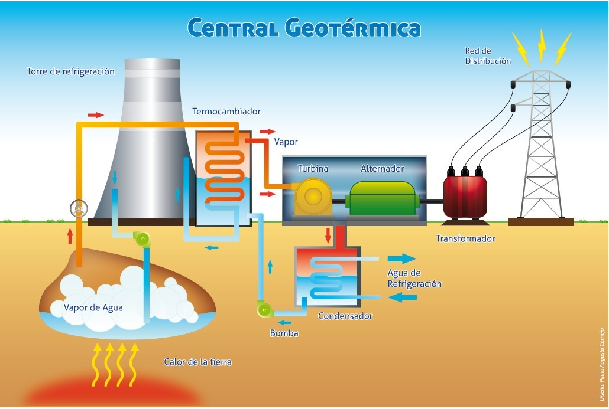

# 🌋 Planta Geotérmica 3D — Blender + Unity (DEMO)

**Resumen:**
Modelado, diseño y simulación interactiva de una **planta de energía geotérmica** a partir de un plano 2D.
El proyecto incluye modelado en Blender y programación de interactividad en Unity, con despliegue en plataforma VRChat para exploración en tiempo real.

**Tecnologías:** Blender · Unity · C# · VRChat SDK

---

## 🎥 Demo (gif / video)

[▶ Ver video demostrativo (YouTube/Vimeo)](https://youtu.be/elT2BAKFBe4)

---

## ✨ Características clave

* Conversión de **plano 2D** en modelo 3D completo en Blender.

* Simulación del **ciclo energético geotérmico**: extracción, vaporización, turbina, condensador, reinyección.
* Modelado de **componentes clave**: torre de refrigeración, alternador, turbina, vaporductos.
* Integración de scripts en **Unity (C#)** para representar procesos físicos.
* Publicación interactiva en **VRChat** como entorno explorable.

---

## 📂 Estructura del repo

* `assets/` → imágenes y GIFs de Blender y Unity.

---

## 🔒 Código

El proyecto completo (archivos Blender, Unity y scripts de simulación) se mantiene en un **repositorio privado**.

**Acceso al código:** disponible bajo solicitud.

---

## 📬 Contacto 

Para acceder a la demo privada o detalles técnicos, contáctame en: [tu.email@ejemplo.com](mailto:tu.email@ejemplo.com)

